# MANIFEST

## Descripción

Archivos manifiesto YAML para trabajar con Kubernetes, con ejemplos de trabajo en Jenkins y Tekton. Estos archivos se dividen en los siguientes directorios:

* facturas: archivos yaml para hacer el deploy del proyecto de facturas-service, así como el archivo yaml para levantar el servicio del mismo.
* jenkins: archivo de configuración para trabajar el proyecto con la tecnología Jenkins.
* serviceAccount: archivos YAML para la configuración de una cuenta de servicio en kubernetes.
* taskrun: archivos yaml para trabajar con Taskruns usando Tekton en Kubernetes.
* tekton: archivos de ejemplo para generación de un *Hello world* con la herramienta *Tekton*.

## COMANDOS PRINCIPALES
* Listar Pods

        kubectl get pods -n diploe2-ech

* Listar Tasks

        kubectl get tasks -n diploe2-ech

* Listar Taskruns

        kubectl get taskrun -n diploe2-ech

* Listar volúmenes

        kubectl get pvc -n diploe2-ech

* Listar secretos

        kubectl get secrets -n diploe2-ech

* Describir los detalles del taskrun *TASKRUN_NAME*

        kubectl describe taskrun {TASKRUN_NAME} -n diploe2-ech

* Crea un recurso según las configuraciones definidas en el archivo *{FILE_NAME}.yaml*

        kubectl create -f {FILE_NAME}.yaml

* Aplica las configuraciones definidas en el archivo *{FILE_NAME}.yaml*

        kubectl apply -f {FILE_NAME}.yaml

* Elimina el Pod *POD_NAME*

        kubectl delete pod {POD_NAME} -n diploe2-ech

* Elimina la Taskrun *TASKRUN_NAME*

        kubectl delete taskrun {TASKRUN_NAME} -n diploe2-ech

* Muestra los logs del Pod *POD_NAME*

        kubectl logs {POD_NAME} -n diploe2-ech

## facturas
### facturas-deployment.yaml
Configuración para la creación de un deploy del proyecto *facturas-service* en algún ambiente de Kubernetes.

Comando para aplicar los cambios

    kubectl apply -f facturas-deployment.yaml

### facturas-service.yaml
Configuración para la creación de un servicio para definir los puertos del proyecto *facturas-service* para algún ambiente de Kubernetes.

Comando para aplicar los cambios

    kubectl apply -f  facturas-service.yaml

## jenkins
### Jenkinsfile
Archivo con la Pipeline de Jenkins para realizar las operaciones siguientes por etapas:

1. **Initialize**: muestra información general de Java, limpia el proyecto de Maven y crea los paquetes.
2. **Build**: construye una nueva versión del proyecto en un contenedor para Docker, usando el Dockerfile.
3. **Login & Push**: loggea al usuario de DockerHub y realiza un push de la imagen generada en el paso 2.

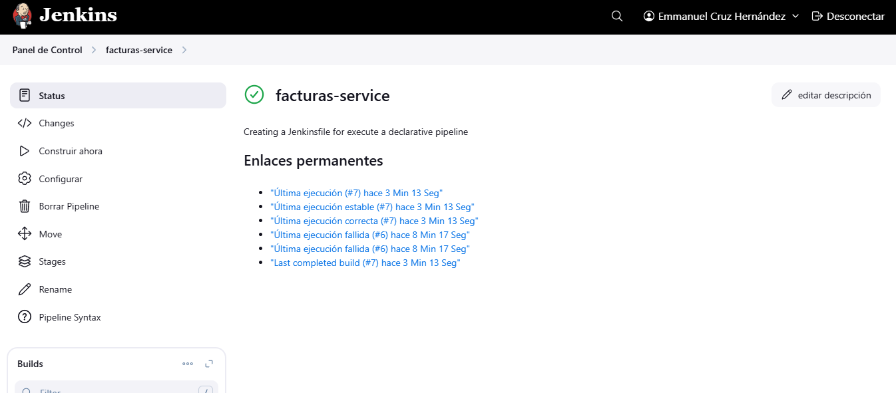

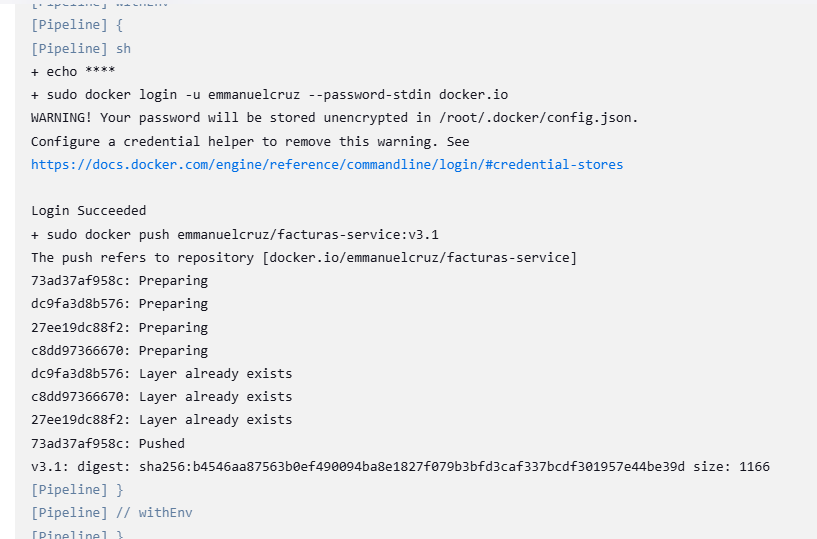

## serviceAccount
### docker-secret.yaml
Configuración para la creación de un secreto para configurar la conexión con el Hub de Docker en el namespace *diploe2-ech*.

Comando para aplicar los cambios

    kubectl apply -f docker-secret.yaml

### role-binding.yaml
Configuración para la vinculación del rol *tekton-role* en el namespace *diploe2-ech*.

Comando para aplicar los cambios

    kubectl apply -f role-binding.yaml

### role.yaml
Configuración para la definición de un rol que define los permisos necesarios para acceder a los recursos necesarios para usar *Tekton* en el namespace *diploe2-ech*.

Comando para aplicar los cambios

    kubectl apply -f role.yaml

### service-account.yaml
Configuración para la definición de una cuenta de servicio en el namespace *diploe2-ech*.

Comando para aplicar los cambios

    kubectl apply -f service-account.yaml

## task
### task-echo.yaml
Configuraciones para la creación de una Task eque hace un `echo` de un mensaje

Comando para crear la taskrun

    kubectl create -f task-echo.yaml

## taskrun
### gitclone-taskrun.yaml
Configuraciones para la creación de una Taskrun encargada de realizar la clonación de un repositorio en Git, en este caso particular, para clonar el repositorio [FacturasService](https://github.com/EmmanuelCruz/Modulo5-FacturasService)

Comando para crear la taskrun

    kubectl create -f gitclone-taskrun.yaml

Comando para instalar Task

    kubectl apply -f https://api.hub.tekton.dev/v1/resource/tekton/task/git-clone/0.2/raw

Resultado esperado

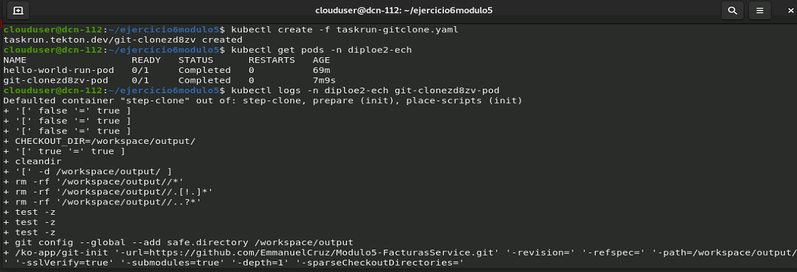
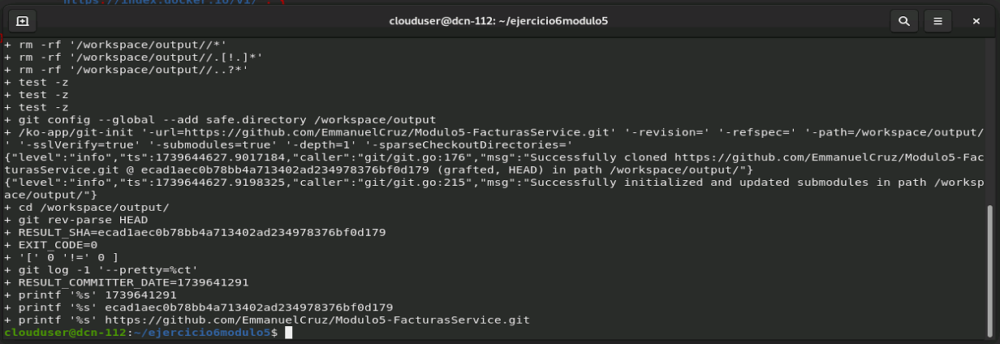

### listdirectory-taskrun.yaml
Configuración para la creación de una Taskrun encargada de listar los archivos que se encuentran en el directorio principal de un workspace usando un volumen.

Comando para crear la taskrun

    kubectl create -f listdirectory-taskrun.yaml

Comando para instalar Task

    kubectl apply -f https://raw.githubusercontent.com/redhat-scholars/tekton-tutorial/refs/heads/master/workspaces/list-directory-task.yaml

Resultado esperado

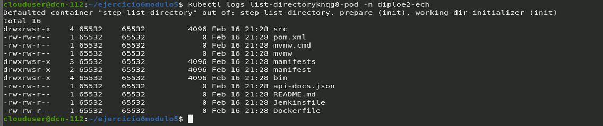

### maven-taskrun.yaml
Configuración para la creación de una Taskrun encargada de correr las operaciones de compilación de un proyecto de Maven, tales como limpiar el proyecto y empaquetar los recursos del proyecto para generar un archivo JAR.

Comando para crear la taskrun

    kubectl create -f maven-taskrun.yaml

Comando para instalar Task

    kubectl apply -f kubectl apply -f https://api.hub.tekton.dev/v1/resource/tekton/task/maven/0.4/raw

Resultado esperado

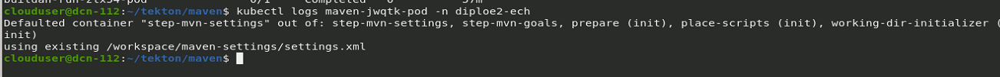

### buildah-taskrun.yaml
Comando para crear la taskrun encargada de construir un proyecto en Maven y hacerle push en DockerHub, creando una nueva versión y subirla en el repositorio [FacturasService](https://github.com/EmmanuelCruz/Modulo5-FacturasService)

    kubectl create -f buildah-taskrun.yaml

Comando para instalar Task

    kubectl apply -f https://api.hub.tekton.dev/v1/resource/tekton/task/buildah/0.9/raw

Resultado esperado

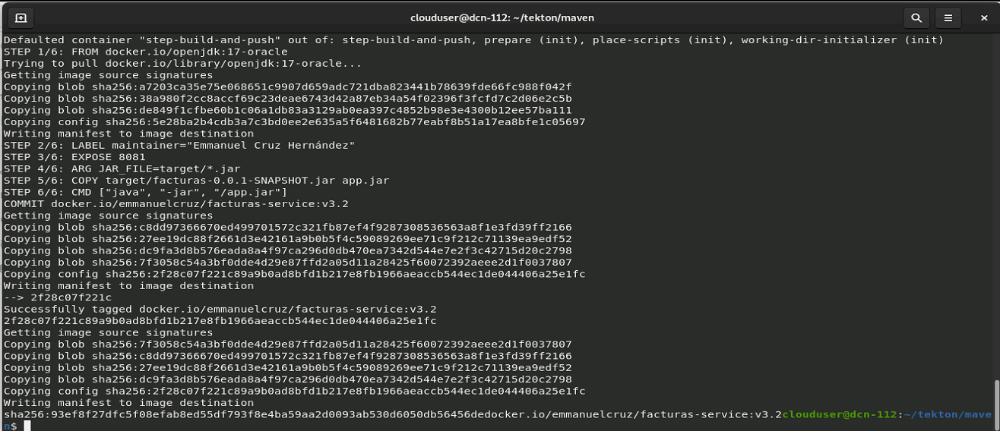

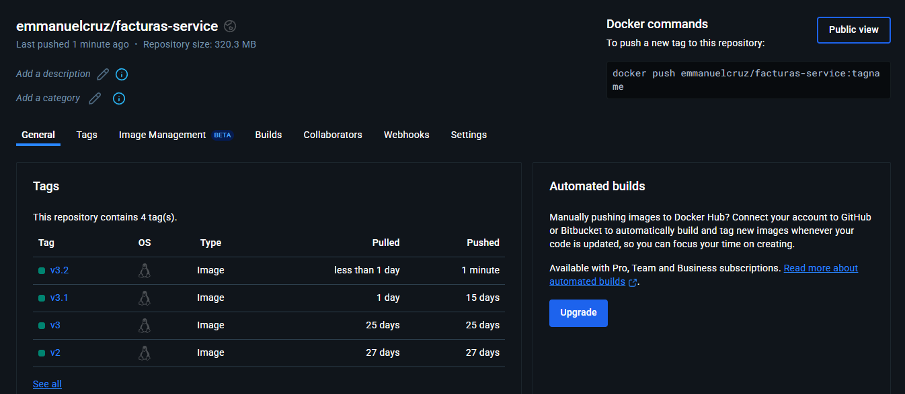

### deployment-taskrun.yaml
Configuraciones para la creación de una Taskrun encargada de realizar un deploy del proyecto *facturas-service* en Maven al repositorio en DockerHub, llamado [emmanuelcruz/facturas-service](https://hub.docker.com/repository/docker/emmanuelcruz/facturas-service/general)

Comando para crear la taskrun

    kubectl create -f deployment-taskrun.yaml

Comando para instalar Task

    kubectl apply -f https://api.hub.tekton.dev/v1/resource/tekton/task/kubernetes-actions/0.2/raw

Resultado esperado

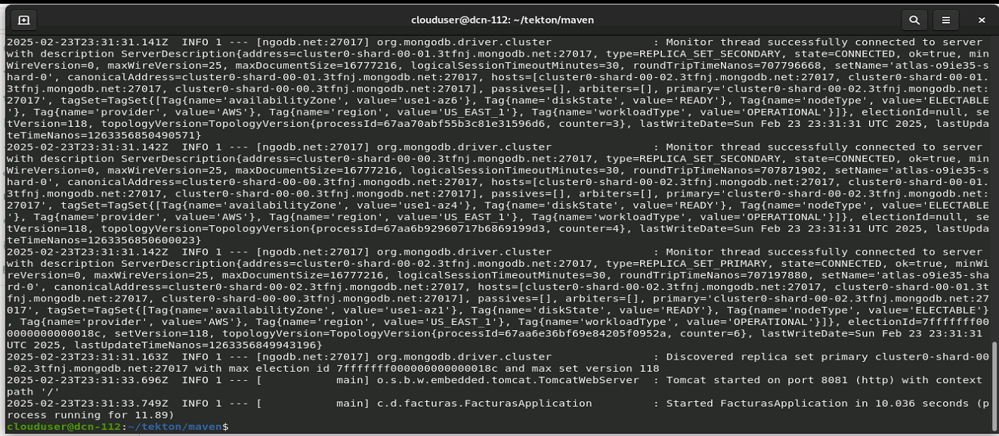

### update-deployment-taskrun.yaml
Configuraciones para la creación de una Taskrun encargada de actualizar los recursos por medio de un *patch*, el cual, permite actualizar los campos de un recurso mediante un merge de forma estratégica, en este caso, para actualizar un deployment de *facturas-service* con una imagen en DockerHub.

Comando para crear la taskrun

    kubectl create -f update-deployment-taskrun.yaml

Comando para instalar Task

    kubectl apply -f https://api.hub.tekton.dev/v1/resource/tekton/task/kubernetes-actions/0.2/raw

Resultado esperado

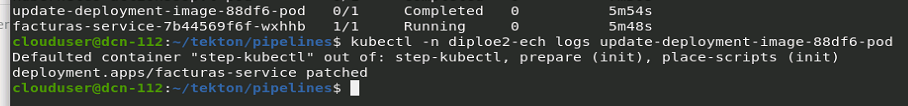

### persisten-volume.yaml
Configuración para la creación de un volumen persistente con capacidad de 1Gi.

Comando para crear el volumen

    kubectl apply -f persisten-volume.yaml

## pipeline
### tekton-pipeline-hello-world.yaml
Configuraciones para la creación de una Pipeline encargada de realizar las siguientes tareas

* **hello**: Imprime un mensaje con `echo`. Usa la Task *task-echo*
* **git-clone**: Clona un repositorio de Git. Usa la Task *git-clone*
* **goodbye**: Después de que corre la task *git-clone*, usa la imagen *busybox* para imprimir el mensaje *my first pipeline is done and executed!*. Este paso crea una tarea "al vuelo", es decir, se crea al mismo momento en que se espeficica en la Pipeline.

Comando para crear la Pipeline

    kubectl create -f tekton-pipeline-hello-world.yaml

## pipelinerun
## 
Configuraciones para la creación de una Pipelinerun encargada de correr la Pipeline resultante de crear las configuraciones del YAML llamado **tekton-pipeline-hello-world.yaml**.

Comando para crear la Pipelinerun

    kubectl create -f tekton-pipelinerun-hello-world.yaml

Resultado esperado

* Creación de tres Taskruns y tres Pods

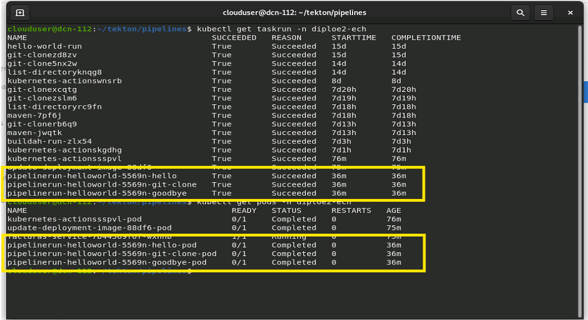

* Salida del Pod *hello-world-pod*

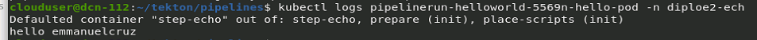

* Salida del Pod *git-clone-pod*

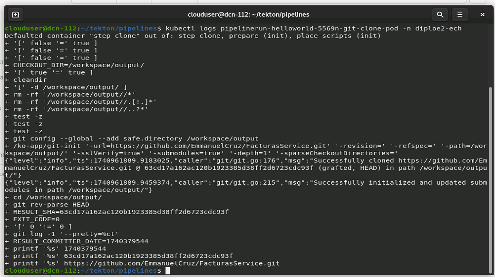

* Salida del Pod *goodbye-pod*

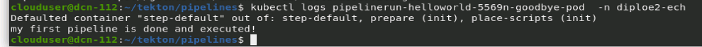

## tekton
### hello-worl-task.yaml
Configuración para la creación de una Task encargada de correr la ejemplificación de un *Hello-world* usando el comando *echo*.

Comando para crear la task

    kubectl create -f hello-worl-task.yaml

### hello-world-taskrun.yaml
Configuración para la creación de una Taskrun encargada de correr la tarea *hello-world*, la cual muestra en los logs de un pod, un *Hello-world*.

Comando para crear la taskrun

    kubectl create -f hello-world-taskrun.yaml

Resultado esperado

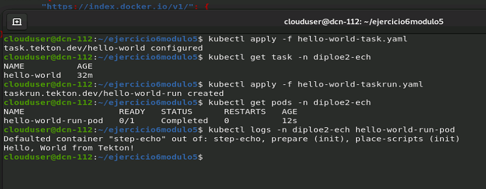
